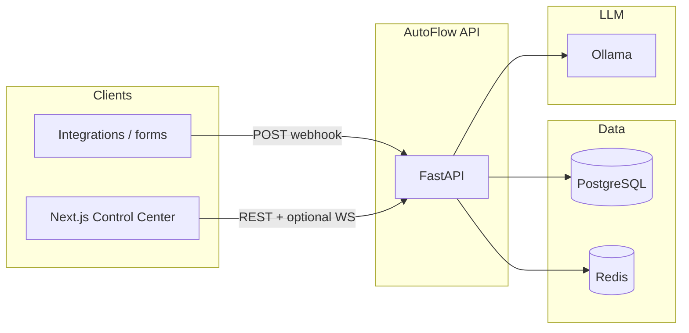
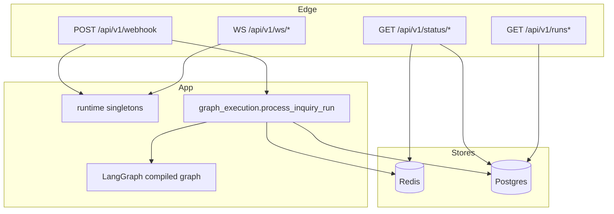
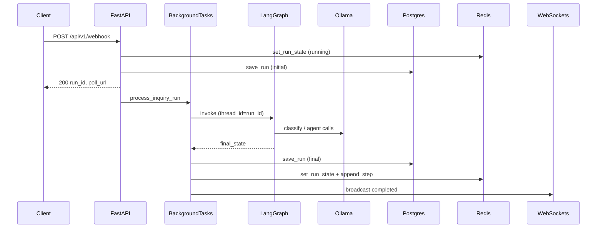

# AutoFlow

**Multi-agent inquiry automation** for inbound business traffic: classify intent, route to specialist behavior (FAQ, sales, support), draft or escalate with an auditable trail. Inference is **local-first** via [Ollama](https://ollama.com) (default model `llama3`); there is no dependency on hosted LLM APIs for core processing.

This repository is structured as a **reference implementation** suitable for security review, architecture discussions, and extension into production: typed HTTP surface, explicit orchestration graph, split persistence (hot vs durable), operator UI, and documented operational gaps.

---

## Table of contents

1. [Executive summary](#1-executive-summary)
2. [Architectural goals](#2-architectural-goals)
3. [System context](#3-system-context)
4. [Logical architecture](#4-logical-architecture)
5. [Runtime components](#5-runtime-components)
6. [Orchestration (LangGraph)](#6-orchestration-langgraph)
7. [Data & state management](#7-data--state-management)
8. [Request lifecycle](#8-request-lifecycle)
9. [API surface](#9-api-surface)
10. [Security model](#10-security-model)
11. [Observability & reliability](#11-observability--reliability)
12. [Configuration](#12-configuration)
13. [Deployment topologies](#13-deployment-topologies)
14. [Local development](#14-local-development)
15. [Testing & quality](#15-testing--quality)
16. [Extension roadmap](#16-extension-roadmap)
17. [Additional documentation](#17-additional-documentation)

---

## 1. Executive summary

AutoFlow accepts **structured inquiries** (name, email, subject, body, optional metadata) through a versioned **REST webhook**, executes a **deterministic LangGraph** workflow backed by **Ollama** for classification and agent steps, persists outcomes to **PostgreSQL**, caches volatile run state in **Redis**, and exposes a **Next.js** control center for health, history, submission, and optional WebSocket observation.

**Differentiators** relative to ad-hoc LLM demos:

| Concern | How AutoFlow addresses it |
|--------|----------------------------|
| **Ingress hardening** | Per-IP rate limits (slowapi), optional API keys, optional idempotency, OpenAPI security metadata |
| **Orchestration clarity** | Explicit graph nodes and conditional edges; state schema (`AgentState`) is typed |
| **Persistence** | Durable run records and agent step JSON in Postgres; TTL’d snapshots and step streams in Redis |
| **Failure & degradation** | Health aggregates DB + Redis + Ollama; structured errors with `request_id`; safe 500 bodies in production |
| **Operator experience** | Dashboard for submit / live / history; humanized offline errors |

---

## 2. Architectural goals

- **Separation of concerns**: HTTP routers stay thin; graph execution and persistence live in dedicated modules (`app/services/graph_execution.py`, `app/db/database.py`).
- **Avoid circular imports**: Process-wide singletons (graph, Redis, Ollama client, WebSocket manager) are attached in `app/runtime.py` during FastAPI lifespan, not imported from `app.main` inside routers.
- **Async I/O at the edge, controlled blocking for local LLM**: The LangGraph `invoke` path runs in a worker thread (`asyncio.to_thread`) so a blocking Ollama HTTP client does not stall the event loop.
- **Defense in depth at the boundary**: Rate limits, optional secrets, validation errors with structured payloads, and admin-gated destructive operations.
- **Auditability**: Agent steps are appended as structured dicts; Postgres stores the authoritative run row for disputes and reporting.

---

## 3. System context

External actors and systems:



---

## 4. Logical architecture

Layered view (top to bottom):

| Layer | Responsibility | Primary artifacts |
|-------|----------------|-------------------|
| **Presentation** | Operator UI, API client, charts | `frontend/` (Next.js 14, React 18, TypeScript, Tailwind, Recharts) |
| **API / edge** | Routing, validation, CORS, rate limits, request IDs, error mapping | `app/main.py`, `app/routers/*`, `app/middleware/request_id.py`, `app/errors.py`, `app/limiter.py` |
| **Orchestration** | Intent classification, branching, handoff, synthesis | `app/agents/orchestrator.py`, `app/agents/*_agent.py` |
| **Domain tools** | Knowledge, CRM, email (simulated send / draft) | `app/tools/*.py` |
| **Integration** | LLM HTTP client | `app/utils/ollama_client.py` |
| **Hot state** | Run snapshot, idempotency maps, rate-limit storage, step lists | `app/memory/redis_memory.py` |
| **Durable state** | Run records, migrations via metadata | `app/db/*`, SQLAlchemy async + asyncpg |



---

## 5. Runtime components

### 5.1 FastAPI application (`app/main.py`)

- **Lifespan**: On startup — `init_db()` (creates tables from ORM metadata), constructs `OllamaClient`, `RedisMemory`, agent/tool instances, **compiles** the LangGraph, instantiates `WebSocketManager`. On shutdown — disposes the async SQLAlchemy engine and clears runtime references.
- **Middleware**: `CORSMiddleware` (origins from `CORS_ORIGINS`; credentials disabled when `*` is used), `RequestIdMiddleware` (accepts or generates `X-Request-ID`, echoes on response).
- **Exception handling**: `RequestValidationError` → structured 422; unhandled exceptions → 500 with `request_id` (message detail gated by `APP_ENV`); `RateLimitExceeded` → slowapi handler.
- **OpenAPI**: Custom schema builder (`app/openapi.py`) documents API key schemes for generators and reviews.

### 5.2 Graph execution (`app/services/graph_execution.py`)

- Invoked as a **FastAPI `BackgroundTasks`** handler after the webhook returns **`200`** with `run_id` and `running` status (async continuation; clients poll or use WebSockets).
- Calls `graph.invoke(initial_state, config)` with `configurable.thread_id = run_id` for checkpoint scoping.
- On success: `save_run` to Postgres, `set_run_state` to Redis (JSON-safe messages), `append_step` per agent step, WebSocket broadcast with **JSON-serializable** state (`app/utils/state_json.py`).
- On failure: logs exception, marks run `error`, persists, broadcasts error payload.

### 5.3 WebSocket manager (`app/websocket_manager.py`)

- In-memory registry of connections per `run_id` (suitable for single-process or sticky-session deployments; see [§13](#13-deployment-topologies)).

### 5.4 Control Center (`frontend/`)

- **Tabs**: submit inquiry (calls webhook-compatible API), live run + steps (polling / refresh), history with filters.
- **API base**: `NEXT_PUBLIC_API_BASE` (default `http://localhost:8000`).
- **Optional shared secret**: `NEXT_PUBLIC_WEBHOOK_API_KEY` for browser calls when the backend requires `X-API-Key` / WS token parity.

---

## 6. Orchestration (LangGraph)

### 6.1 State model

`AgentState` (`app/models/state.py`) is a **TypedDict** with `Annotated[list, add_messages]` for the `messages` channel so LangGraph merges message deltas correctly.

### 6.2 Graph topology (`app/agents/orchestrator.py`)

1. **`classify_intent`** — Ollama JSON classification into one of the defined `INTENT_CATEGORIES`; records an orchestrator step in `agent_steps`.
2. **Conditional route** — `route_by_intent`:
   - `faq_node` for `general_inquiry` / `faq`
   - `lead_node` for `sales`, `pricing`, `demo_request`, `upgrade`
   - `support_node` for `support`, `bug_report`, `complaint`, `billing_issue`
3. **Specialist nodes** — May set `escalate`, `escalation_reason`, `resolution_draft`, lead fields, etc.
4. **Per specialist** — `route_after_agent`: if `escalate` → `handoff_node`, else → `synthesize_response_node`.
5. **`handoff_node`** — Human-ready handoff copy when escalated.
6. **`synthesize_response_node`** — Drafts final customer-facing text (unless already escalated), invokes simulated email send.
7. **`log_audit`** — Terminal bookkeeping before `END`.

The graph is **compiled with a checkpointer** (`app/memory/thread_memory.py` → LangGraph `MemorySaver`). That provides thread-scoped replay within a process; it is **not** a distributed or durable checkpoint store—scale-out implications are noted in [§13](#13-deployment-topologies).

### 6.3 Intent taxonomy

Categories are enumerated in `INTENT_CATEGORIES` and used consistently for routing and analytics. Adjusting them requires aligned changes to prompts, routing table, and any downstream reporting.

---

## 7. Data & state management

### 7.1 PostgreSQL (durable)

- **ORM**: SQLAlchemy 2.x async; engine from `DATABASE_URL` (`postgresql+asyncpg://...`).
- **Table `runs`**: `RunRecord` (`app/db/models.py`) — `run_id`, status, intent, confidence, sender fields, subject, `raw_input`, `final_response`, lead score/tier, escalation flags, **`agent_steps` as JSON**, timestamps.
- **Host port (Docker Compose)**: Postgres is published on **host `5433`** → container `5432` to reduce collisions with a local PostgreSQL on `5432` (common on Windows). Defaults in `app/config.py` and `.env.example` match this layout.

### 7.2 Redis (ephemeral / acceleration)

Key patterns (`app/memory/redis_memory.py`):

| Key pattern | Purpose |
|-------------|---------|
| `autoflow:run:{run_id}` | JSON snapshot of run state (messages stored via `state_json_safe` — LangChain messages are not raw-serialized) |
| `autoflow:steps:{run_id}` | List of step JSON blobs |
| `autoflow:idempotency:{sha256}` | Maps `Idempotency-Key` → `run_id` with TTL |

Optional **slowapi** backend: `RATE_LIMIT_STORAGE=redis` uses `REDIS_URL` for shared counters across workers.

### 7.3 Consistency model

- Webhook path writes **Redis snapshot** then **`save_run`** to Postgres for the initial row; background completion **updates** both.
- **`GET /status/{run_id}`** prefers Redis when present, else falls back to Postgres — operators see low-latency state while running, durable state after completion or if Redis evicted keys.

---

## 8. Request lifecycle



---

## 9. API surface

| Method | Path | Purpose |
|--------|------|---------|
| `GET` | `/health` | Aggregate: `status` (`ok` / `degraded`), booleans for Ollama, Redis, database ping |
| `GET` | `/` | Minimal service discovery payload |
| `POST` | `/api/v1/webhook` | Ingest inquiry; optional `X-API-Key`, `Idempotency-Key`; rate-limited; returns `WebhookResponse` |
| `GET` | `/api/v1/status/{run_id}` | Poll run status (`RunStatus`); Redis-first |
| `GET` | `/api/v1/status/{run_id}/steps` | Redis-backed step list |
| `GET` | `/api/v1/ws/{run_id}` | Live updates; `?token=` when webhook key is configured |
| `GET` | `/api/v1/runs` | Recent runs (`RunListItem[]`) |
| `GET` | `/api/v1/runs/{run_id}` | Full `RunStatus` from DB |
| `DELETE` | `/api/v1/runs/{run_id}` | Deletes DB row and Redis keys; optional `X-Admin-Key` |

Interactive contract: **`/docs`** (Swagger UI).

---

## 10. Security model

| Mechanism | Configuration | Behavior |
|-----------|---------------|----------|
| **Webhook auth** | `WEBHOOK_API_KEY` | When set, `POST /webhook` requires matching `X-API-Key` |
| **WebSocket auth** | Same secret | Clients pass `?token=` query param |
| **Admin delete** | `AUTOFLOW_ADMIN_API_KEY` | When set, `DELETE /runs/{id}` requires `X-Admin-Key` |
| **Rate limiting** | `WEBHOOK_RATE_LIMIT`, `RATE_LIMIT_STORAGE` | Per client IP; headers enabled; Redis-backed optional |
| **Idempotency** | `IDEMPOTENCY_TTL_SECONDS` | Header `Idempotency-Key` dedupes to same `run_id` |
| **CORS** | `CORS_ORIGINS` | Explicit origins for credentialed browser use; `*` for local-only |
| **Error disclosure** | `APP_ENV` | Production 500s return generic text + `request_id` |

**Not included** (typical next hardening steps): signed webhook payloads (HMAC), mTLS, per-tenant isolation, OAuth for UI, field-level encryption, WAF rules.

---

## 11. Observability & reliability

- **Request tracing**: Every response includes `X-Request-ID` (or echoes client-provided value). Unhandled errors log the same id (`app/errors.py`).
- **Structured logging**: UTC timestamps, level, logger name (`app/main.py` `_configure_logging`).
- **Health semantics**: `degraded` when **database or Redis** fails ping; Ollama false does **not** flip degraded (LLM may be temporarily absent while API remains coherent).
- **Graceful shutdown**: Async engine disposal on lifespan exit.

**Recommended production additions**: OpenTelemetry traces (span per graph node), metrics (histogram of graph duration, webhook rate, Ollama errors), centralized log shipping, synthetic probes on `/health`.

---

## 12. Configuration

All settings are **environment-driven** (`pydantic-settings`, optional `.env` file). Highlights:

| Variable | Role |
|----------|------|
| `OLLAMA_BASE_URL`, `LLM_MODEL` | Ollama endpoint and model id |
| `REDIS_URL` | Redis connection URI |
| `DATABASE_URL` / `SYNC_DATABASE_URL` | Async and sync Postgres URLs |
| `ESCALATION_CONFIDENCE_THRESHOLD`, `MAX_AGENT_ITERATIONS` | Graph behavior tuning |
| `WEBSOCKET_HEARTBEAT_SECONDS` | WS keepalive interval |
| `APP_ENV` | `development` vs `production` error verbosity |
| `CORS_ORIGINS` | Browser origin allowlist |
| `WEBHOOK_API_KEY`, `AUTOFLOW_ADMIN_API_KEY` | Optional secrets |
| `WEBHOOK_RATE_LIMIT`, `RATE_LIMIT_STORAGE` | Ingress throttle + backend |
| `IDEMPOTENCY_TTL_SECONDS` | Idempotency key retention |
| `LOG_LEVEL` | Logging verbosity |

Copy **`.env.example`** → **`.env`** and adjust for each environment.

---

## 13. Deployment topologies

| Topology | Fit | Caveats |
|----------|-----|---------|
| **Single container / single VM** | Demos, low traffic | WebSocket registry and `MemorySaver` checkpoint are **in-process** |
| **API replicas + Redis + Postgres** | Higher HTTP throughput | Use **sticky sessions** or replace in-memory WS registry with Redis pub/sub; replace `MemorySaver` with a **durable LangGraph checkpointer** (e.g. Postgres) for correct replay across instances |
| **Worker queue** (recommended at scale) | Burst isolation, retries | Move `process_inquiry_run` off `BackgroundTasks` into Celery/RQ/Arq/SQS + separate worker process |
| **Compose stack** | Local / small team | `docker-compose.yml`: `redis`, `postgres`; optional `autoflow` build (`network_mode: host` on the app service is **Linux-oriented**—on Windows/macOS, run Uvicorn directly against Compose infra) |

---

## 14. Local development

**Requirements**: Python **≥3.11**, Node.js for the frontend, Ollama with `llama3` pulled, Docker (optional but recommended for Redis + Postgres).

**Backend**

```bash
pip install -r requirements.txt
ollama pull llama3
cp .env.example .env
docker compose up redis postgres -d
uvicorn app.main:app --reload --host 127.0.0.1 --port 8000
```

**Frontend**

```bash
cd frontend
npm install
npm run dev
```

Set `NEXT_PUBLIC_API_BASE` if the API is not on `http://localhost:8000` (see `frontend/.env.example`).

**Load / demo scripts**

- `python scripts/simulate_requests.py` — randomized webhook traffic.
- `python scripts/seed_portfolio_screenshot.py` — deterministic seed for UI screenshots (see `docs/UPWORK_PORTFOLIO.md`).

---

## 15. Testing & quality

**Prerequisites:** PostgreSQL and Redis must match `DATABASE_URL` / `REDIS_URL` (e.g. `docker compose up redis postgres -d`). HTTP tests use `TestClient` inside a context manager so **lifespan** runs; the `client` fixture in `tests/conftest.py` stubs `build_graph` so runs finish **without a live Ollama** (fast CI).

```bash
pytest -q
ruff check app scripts tests
```

GitHub Actions (`.github/workflows/ci.yml`) starts Postgres and Redis service containers and runs `pytest`. **Integration tests** with Testcontainers and **contract tests** against Ollama remain optional hardening steps.

---

## 16. Extension roadmap

Short list of upgrades that typically appear between “credible reference” and **contracted production**:

- Signed or HMAC-verified webhooks; per-tenant API keys and quotas  
- **Queue-backed** graph execution with idempotent workers and DLQ  
- **Durable LangGraph checkpoint** store + migration strategy  
- Distributed WebSocket fan-out (Redis Streams / pub-sub)  
- Full **OpenTelemetry** + metrics + SLO dashboards  
- Evaluation harness per intent (offline datasets, regression gates)  
- AuthN/Z for the control center (OIDC), RBAC for admin routes  

---

## 17. Additional documentation

| Document | Contents |
|----------|----------|
| [docs/PRODUCTION_CHECKLIST.md](docs/PRODUCTION_CHECKLIST.md) | Operator handoff checklist |
| [docs/UPWORK_PORTFOLIO.md](docs/UPWORK_PORTFOLIO.md) | Portfolio copy, pricing anchors, screenshot workflow |

---

## Contact

Reference implementation for architecture and integration discussions. Inference remains **local** via Ollama unless you intentionally replace `OllamaClient` with another backend.
